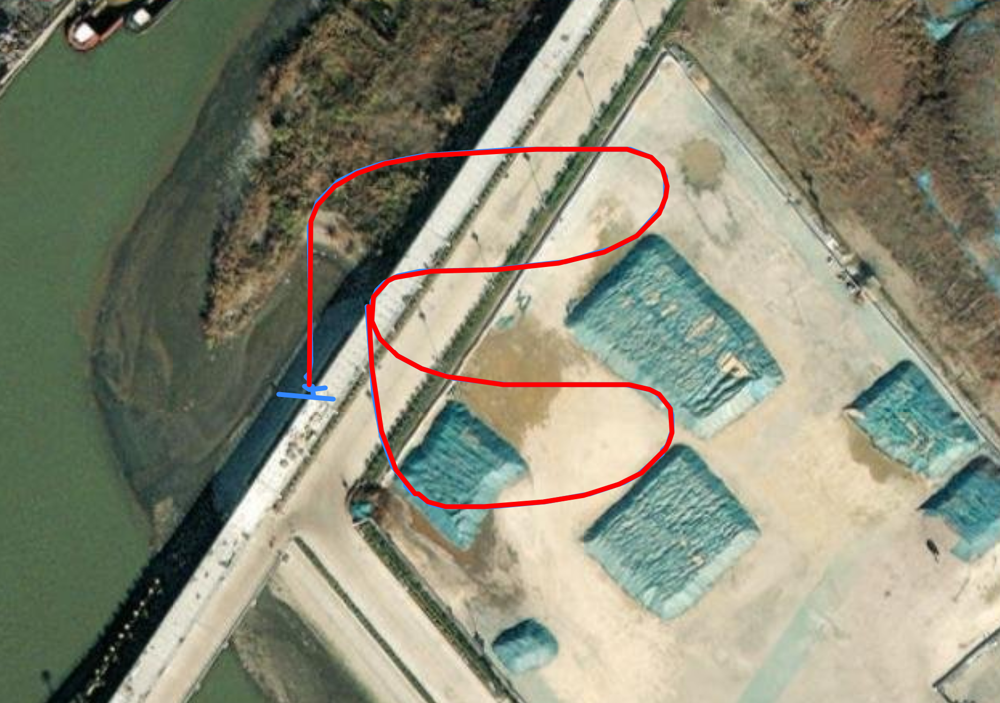

# Sensor Fusion
Simulated test flight with 100Hz IMU sample rate and 10Hz GPS sample rate:

The red trace in the map (true path) and the blue trace (path generated with the algorithm from emulated IMU and GPS data) overlap almost perfectly once
initial GPS noise is filtered out. Note: the emulated data has injected noise to better represent real conditions.

## Concept
Full Fusion is a custom implementation of a loosely coupled extended Kalman filter. The goal of the filter is to provide better flight data for the other
software modules. This repo also includes files for testing the filter and visualizing flight data.

## Architecture
The filter receives raw IMU and GPS data from the plane and outputs filtered position, velocity, and attitude. The data is passed in as a dictionary and the filter accesses the 
required keys for each operation. To access specific information, use the getter functions inside the KalmanFilter class, which maintains the navigation solution and the necessary
history. 
